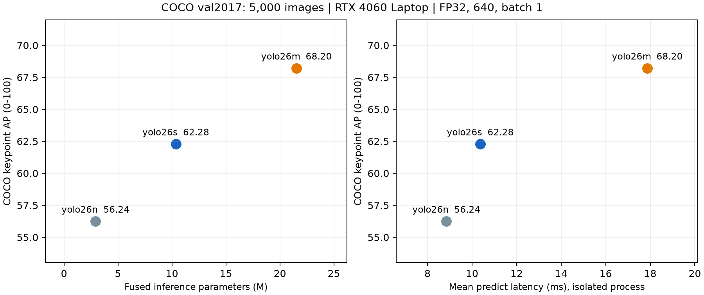
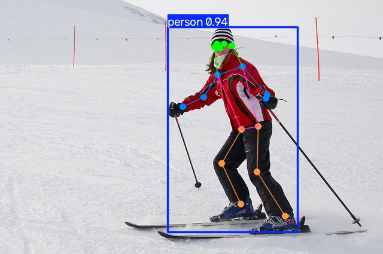

# Human Pose Estimation: Accuracy vs. Laptop Inference Time

How much accuracy does a larger pose model buy, and what does it cost on a laptop GPU?

This project compares pretrained YOLO26 n/s/m pose models on all 5,000 COCO val2017 images using the official COCO keypoint evaluator. It measures inference time separately on an RTX 4060 Laptop GPU (8 GB). No model training or fine-tuning was performed.

## Locally measured results

| Model | Fused parameters (M) | Pose AP (0–100) | Mean latency (ms) | P95 latency (ms) |
|---|---:|---:|---:|---:|
| yolo26n-pose | 2.93 | 56.24 | 8.85 | 16.19 |
| yolo26s-pose | 10.36 | 62.28 | 10.37 | 16.28 |
| yolo26m-pose | 21.54 | 68.20 | 17.87 | 18.84 |

Accuracy is from the full validation run. Latency is from a fresh process per model: 50 warmups, 100 fixed predecoded images repeated three times, CUDA synchronization, FP32, TF32 off, batch 1, and 640×640 letterbox input. It includes the predict API, preprocessing, inference, and postprocessing; disk reads, video decoding, and rendering are excluded. These times are not end-to-end video FPS.

YOLO26s-pose is a practical default for this measured trade-off; YOLO26m-pose is the accuracy-oriented alternative. The preferred model depends on the application's accuracy and latency targets.





Example images come from COCO val2017, with model predictions overlaid.

## Reproduce

Use Python 3.12 and a CUDA-compatible NVIDIA GPU for the supplied GPU benchmark commands. The experiment environment used PyTorch 2.8.0/CUDA 12.8; dependencies are recorded in `results/full/environment.json`.

```powershell
python -m venv .venv
.\.venv\Scripts\Activate.ps1
python -m pip install torch==2.8.0 torchvision==0.23.0 --index-url https://download.pytorch.org/whl/cu128
python -m pip install -r requirements.txt
python scripts/prepare_data.py --cache ./.cache
python scripts/evaluate.py --cache ./.cache --output ./results/full-rerun
foreach ($model in @('yolo26n-pose','yolo26s-pose','yolo26m-pose')) {
    python scripts/benchmark_latency.py --cache ./.cache --output ./results/latency-rerun --model $model
}
```

For an eight-image pipeline check, add `--models yolo26n-pose --limit 8` to the evaluation command and use a separate output directory. Data preparation downloads approximately 1.1 GB of compressed COCO data plus model weights. Existing recorded results are retained when using the rerun directories above.

## Evidence and scope

- [Full accuracy summary](results/full/summary.json), [protocol](results/full/protocol.json), and the common 5,000-image ID list.
- Per-model metrics and COCOeval output under `results/full/`; raw timing samples under `results/isolated-latency/`.
- [Model survey](MODEL_SURVEY.md), [experiment record](EXPERIMENT_LOG.md), and [detailed Chinese report](README.zh-CN.md).
- Dataset caches, pretrained weights, full prediction dumps, and machine-specific logs are not bundled. Scripts regenerate prediction dumps locally.
- This is a COCO-pretrained-model validation study, not evidence of unseen-domain generalization, training reproduction, mobile deployment, or tracking accuracy.
- Published upstream metrics and local measurements are distinguished in the detailed report; this project does not claim exact reproduction of the upstream leaderboard.

The public runner uses repository-relative caches and an independently installed Python environment. Syntax, stored evidence, and file links were checked; the exported environment has not been rerun on a second machine.

Sources: [Ultralytics pose documentation](https://docs.ultralytics.com/tasks/pose/), [COCO dataset](https://cocodataset.org/).
